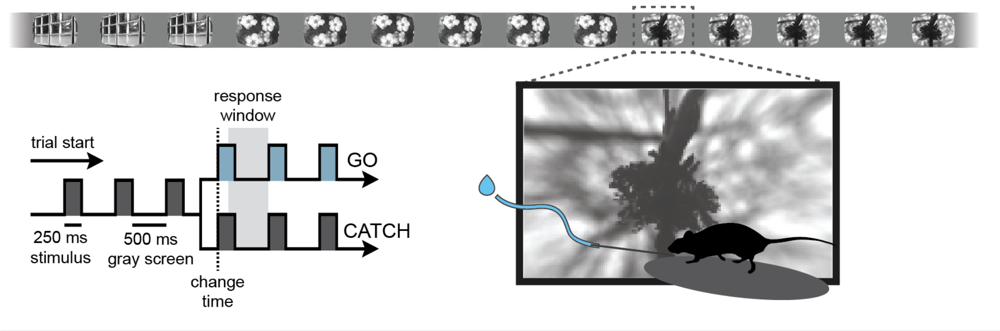

# NMA Allen Visual Behavior 2p




## Project Overview

This repository contains code and notebooks for Neuromatch Academy (NMA2025) Computational Neuroscience course project analyzing the Allen Institute Visual Behavior 2-Photon (2P) dataset.

We investigate how excitatory, VIP, and SST neurons in mouse V1 respond to:
 - Novel vs. familiar image presentations
 - Unexpected image omissions

The project uses exploratory data analysis (EDA), statistical modeling, and decoding analyses.


## Project Structure
```
├── EDA.ipynb                 # Exploratory data analysis
├── ...
├── ...
├── ...
├── ...
├── figures/                  # Plots and figures
├── README.md                 # Project description and instructions
```


## Dataset
- Allen Institute Visual Behavior 2P Dataset
- Downloaded from: [Figshare Link](https://ndownloader.figshare.com/files/28470255)


## License
- MIT License
