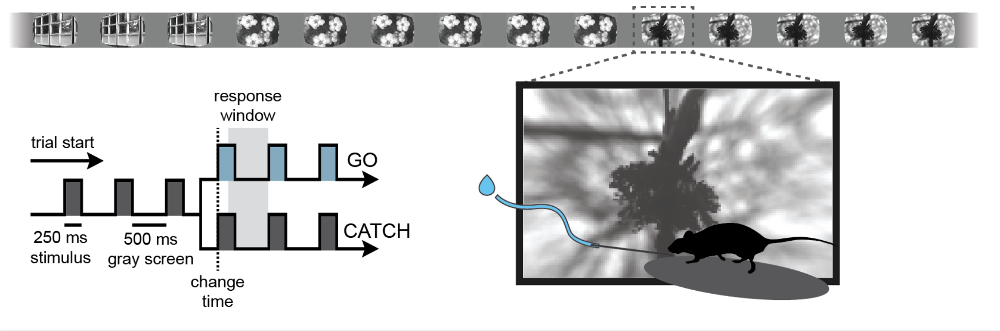

# 🧠 Prediction Error Signaling in VIP and SST Neurons  
### _An Event-Locked Calcium Signal Analysis of Stimulus Omission in Familiar and Novel Image Sequences_  
**Neuromatch Academy Computational Neuroscience Project (NMA 2025)**

---

## 🔍 Project Overview

This repository contains the code and analyses from our NMA2025 project, where we investigated **prediction-error signaling** in inhibitory neurons of mouse visual cortex, using the [Allen Brain Observatory Visual Behavior 2-Photon (2P) dataset](https://portal.brain-map.org/explore/circuits/visual-behavior-2p).

We focused on **VIP** and **SST** neurons in the primary visual cortex (V1), exploring their response to:

- ✅ **Presented vs. Omitted** image flashes  
- 🌄 **Familiar vs. Novel** image exposure  
- 🧠 **Trial-by-trial calcium signal analysis** using event-locked measures  
- 🤖 **Cell-type classification via decoding models**

---

## ❓ Research Question

**How do VIP and SST neurons encode prediction-error signals during stimulus omissions, and how does this differ between familiar and novel visual contexts?**

---

## 🧬 Methodology

Our analysis pipeline was designed to investigate prediction-error signaling in VIP and SST neurons using calcium imaging data from the **Allen Visual Behavior 2-Photon (2P) dataset**. The pipeline consists of the following key stages:

### 1. 🧹 Preprocessing

- **Baseline Correction**: We first applied baseline correction to calcium fluorescence traces to normalize across trials.
- **Averaging per Cell**: We then averaged the event-locked traces across trials for each unique cell ID, under each combination of:
  - **Cell type** (VIP or SST)
  - **Omission status** (True or False)
  - **Exposure** (Familiar or Novel)

- **Result**: This resulted in a compact DataFrame with 640 rows and the following fields:
  - `mouse_id`, `cell_id`, `cell_type`, `omission`, `exposure`, `mean_trace`

Each `mean_trace` was a vector representing the average event-locked calcium signal for that condition.

### 2. ⚙️ Feature Extraction

From the `mean_trace` vectors, we computed biologically relevant signal features such as:

- **AUC (Area Under Curve)**
- **Peak Amplitude**
- **Latency to Peak**
- **Slope & Timing Windows**

These features formed the input space for statistical analysis and supervised classification.

### 3. 🧪 Statistical Analysis

To test the effects of omission, exposure, and cell type on neural activity:

- We used **three-way ANOVA** to assess:
  - Main effects of `cell_type`, `exposure`, and `omission`
  - All two-way and three-way interaction effects
- We followed this with **post-hoc comparisons** (Tukey HSD and Hedges' g) to estimate effect sizes and pairwise differences

This revealed strong prediction-error dynamics in VIP neurons, particularly under **familiar + omitted** conditions.

### 4. 🔍 Spike Inference with CASCADE

In parallel, we also analyzed raw calcium traces using **CASCADE**, a state-of-the-art deep learning model for supervised spike inference ([Berens et al., 2021](https://www.nature.com/articles/s41593-021-00880-4)):

- **CASCADE output**: `spike_prob` — estimated spike probability per time bin
- We extracted spike-based features (e.g., average spike rate in different bins) and repeated the full factorial ANOVA
- These results corroborated our findings using traditional calcium features

### 5. 🤖 Machine Learning Pipeline

To determine if neuron types and stimulus conditions could be decoded from event-locked activity:

- We trained several classifiers on the extracted features:
  - **Logistic Regression**
  - **Random Forest**
  - **Gradient Boosting**
  - **XGBoost**
  - **SVM (RBF)**
  - **k-Nearest Neighbors**

#### 🧪 Leave-One-Mouse-Out Cross-Validation (LOMO)

To ensure generalization across individual animals, we used **Leave-One-Mouse-Out (LOMO)** cross-validation:

- In each fold, data from one mouse was used as the test set
- The model was trained on the remaining 12 mice
- This avoids overfitting and ensures biological generalizability across individuals

The best-performing model (Gradient Boosting) achieved:
- **LOMO Accuracy**: 94.5%
- **Test Accuracy**: 97.7%
- **F1 Score**: 0.976
- **ROC-AUC**: 0.997

---

## 📊 Classifier Performance

| Model             | LOMO Accuracy | Test Accuracy | F1 Score | ROC-AUC |
|------------------|---------------|---------------|----------|---------|
| Gradient Boosting| **0.945**     | **0.977**     | 0.976    | 0.997   |
| XGBoost          | 0.947         | 0.969         | 0.969    | 0.996   |
| Random Forest    | 0.931         | 0.969         | 0.968    | 0.998   |
| Logistic Regression | 0.902     | 0.953         | 0.951    | 0.984   |
| SVM (RBF)        | 0.880         | 0.914         | 0.913    | 0.977   |
| KNN (k=7)        | 0.873         | 0.898         | 0.896    | 0.958   |

- Top features: Early trial (0–500 ms) firing rate and slope  
- Gradient Boosting showed strongest generalization across all 13 mice

---

## 🗂️ Project Structure
├── EDA.ipynb # Exploratory data analysis

├── calcium_analysis.ipynb # Event-locked signal extraction

├── modeling.ipynb # Classifier training & evaluation

├── cascade_spike_inference.ipynb # CASCADE-based spike analysis

├── figures/ # Plots and visualizations

├── data/ # Processed signal and metadata

├── README.md # Project overview

---

## 📁 Dataset

- **Source**: [Allen Institute Visual Behavior 2P Dataset](https://portal.brain-map.org/explore/circuits/visual-behavior-2p)  
- **Download**: [Figshare - Allen SDK Visual Behavior 2P](https://ndownloader.figshare.com/files/28470255)  
- Includes: Cre lines (Vip, Sst), image familiarity tags, 2P calcium recordings

---

##  Team

**Team Name**: _Feisty Bes / VIP Gladiators_  
**Contributors**:
- Hossein Damavandi
- Mohammad Saeed Soleimani 
- Sotoode Aliyari  
- Elnaz Abbaszadeh   
- Niyayesh Yousefi  
- Fatemeh Gholamzadeh  

---

## 📚 References

- Piet et al. (2022) [_Nature Neuroscience_](https://doi.org/10.1038/s41593-022-01146-5)  
- Najafi et al. (2023) [_Nature Neuroscience_](https://doi.org/10.1038/s41593-023-01298-x)  
- Garrett et al. (2023) [_eLife_](https://doi.org/10.7554/eLife.88864)  
- Homann et al. (2023) [_Nature Neuroscience_](https://doi.org/10.1038/s41593-023-01295-0)  

---

## 📄 License

This project is released under the [MIT License](LICENSE).

---

## 🔗 GitHub

➡️ [Project Repository](https://github.com/hosseindamavandi/nma-allen-visual-behavior-2p)

